# 链表术语

## 基本概念

### 链表（Linked List）
一种线性数据结构，由一系列节点组成，每个节点包含数据和指向下一个节点的指针。

**链表 vs 数组对比：**
- 数组：内存连续存储 `[1, 2, 3, 4, 5]`
- 链表：节点分散存储，通过指针连接 `1 -> 2 -> 3 -> 4 -> 5 -> null`

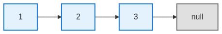

**代码定义：**
```javascript
class ListNode {
  constructor(val, next = null) {
    this.val = val;   // 数据域
    this.next = next; // 指针域
  }
}
```

### 节点（Node）
链表中的基本单位，包含：
- **数据域（Data/val）**：存储数据
- **指针域（Pointer/next）**：指向下一个节点的引用

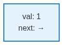

### 头节点（Head）
链表的第一个节点，是访问整个链表的入口点。

**代码示例：**
```javascript
let head = new ListNode(1);
head.next = new ListNode(2);
head.next.next = new ListNode(3);

// head 就是头节点
// head -> 1 -> 2 -> 3 -> null
```


### 尾节点（Tail）
链表的最后一个节点，其指针域指向 `null`。

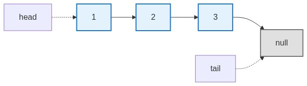

### 空链表（Empty List）
不包含任何节点的链表，头节点为 `null`。

```javascript
let head = null; // 空链表
```

## 链表类型

### 单向链表（Singly Linked List）
每个节点只包含一个指针，指向下一个节点。只能从前往后遍历。


**代码示例：**
```javascript
class ListNode {
  constructor(val, next = null) {
    this.val = val;
    this.next = next;
  }
}

// 创建单向链表：1 -> 2 -> 3
let node3 = new ListNode(3);
let node2 = new ListNode(2, node3);
let node1 = new ListNode(1, node2);
```

### 双向链表（Doubly Linked List）
每个节点包含两个指针：前驱指针（prev）和后继指针（next）。

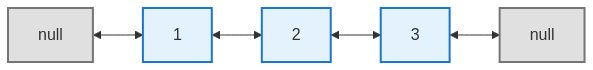

**代码示例：**
```javascript
class DoublyListNode {
  constructor(val, prev = null, next = null) {
    this.val = val;
    this.prev = prev; // 指向前一个节点
    this.next = next; // 指向后一个节点
  }
}
```

### 循环链表（Circular Linked List）
尾节点的指针指向头节点，形成一个环。可以是单向循环或双向循环。

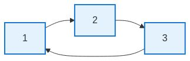

**示例：**
```javascript
let node1 = new ListNode(1);
let node2 = new ListNode(2);
let node3 = new ListNode(3);

node1.next = node2;
node2.next = node3;
node3.next = node1; // 形成环

// 1 -> 2 -> 3 -> 1 -> 2 -> 3 -> ...
```

## 操作术语

### 遍历（Traverse）
从头节点开始，依次访问链表中的每个节点。

**代码示例：**
```javascript
function traverse(head) {
  let current = head;
  while (current !== null) {
    console.log(current.val); // 访问节点数据
    current = current.next;    // 移动到下一个节点
  }
}

// 遍历 1 -> 2 -> 3
// 输出：1, 2, 3
```

**遍历过程演示：**

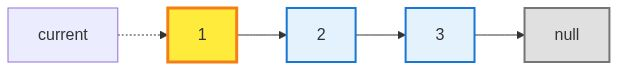  
*初始状态：current 指向 head，准备访问第一个节点*

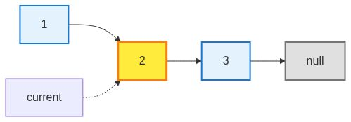  
*访问节点 2：current 移动到第二个节点*

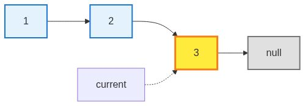  
*访问节点 3：current 移动到第三个节点*

### 插入（Insert）

#### 头插法（Insert at Head）
在链表头部插入新节点。

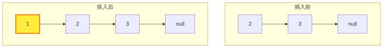

**代码：**
```javascript
function insertAtHead(head, val) {
  let newNode = new ListNode(val);
  newNode.next = head;  // 新节点指向原头节点
  return newNode;       // 返回新头节点
}
```

#### 尾插法（Insert at Tail）
在链表尾部插入新节点。

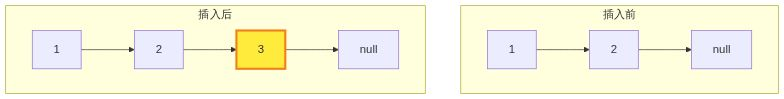

**代码：**
```javascript
function insertAtTail(head, val) {
  let newNode = new ListNode(val);
  
  if (head === null) {
    return newNode;
  }
  
  let current = head;
  while (current.next !== null) {
    current = current.next; // 找到尾节点
  }
  current.next = newNode;   // 在尾部插入
  return head;
}
```

#### 中间插入（Insert at Position）
在指定位置插入新节点。

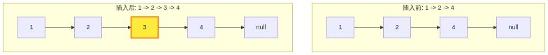

**代码：**
```javascript
function insertAtPosition(head, val, position) {
  let newNode = new ListNode(val);
  
  if (position === 0) {
    newNode.next = head;
    return newNode;
  }
  
  let current = head;
  for (let i = 0; i < position - 1; i++) {
    current = current.next; // 找到插入位置的前一个节点
  }
  
  newNode.next = current.next; // 新节点指向原位置节点
  current.next = newNode;      // 前一个节点指向新节点
  
  return head;
}
```

### 删除（Delete）

#### 删除指定节点
通过修改指针跳过目标节点。

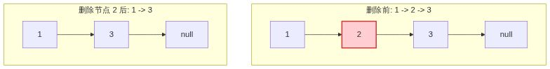

**代码：**
```javascript
function deleteNode(head, val) {
  if (head === null) return null;
  if (head.val === val) return head.next; // 删除头节点
  
  let current = head;
  while (current.next !== null) {
    if (current.next.val === val) {
      current.next = current.next.next; // 跳过目标节点
      break;
    }
    current = current.next;
  }
  return head;
}
```

## 特殊概念

### 虚拟头节点（Dummy Head/Sentinel Node）
在链表头部添加一个不存储实际数据的节点，用于简化边界条件处理。

**不使用虚拟头节点：** 删除头节点时需要特殊判断
```javascript
if (head.val === target) {
  head = head.next;
}
```

**使用虚拟头节点：** 统一处理逻辑
```javascript
dummy -> 1 -> 2 -> 3 -> null
  ↑
始终从 dummy 开始操作
```

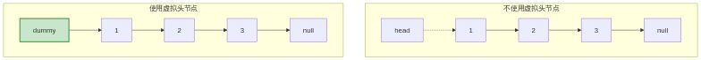

**代码对比：**
```javascript
// 不使用虚拟头节点（需要特殊判断）
function deleteNode(head, val) {
  if (head === null) return null;
  if (head.val === val) return head.next; // 特殊情况
  
  let current = head;
  while (current.next !== null) {
    if (current.next.val === val) {
      current.next = current.next.next;
      break;
    }
    current = current.next;
  }
  return head;
}

// 使用虚拟头节点（统一处理）
function deleteNodeWithDummy(head, val) {
  let dummy = new ListNode(0, head); // 虚拟头节点
  let current = dummy;
  
  while (current.next !== null) {
    if (current.next.val === val) {
      current.next = current.next.next;
      break;
    }
    current = current.next;
  }
  
  return dummy.next; // 返回真实头节点
}
```

### 快慢指针（Two Pointers/Slow-Fast Pointers）
使用两个指针以不同速度遍历链表，常用于查找中点、检测环、查找倒数第 k 个节点。

#### 查找链表中点
slow 每次走 1 步，fast 每次走 2 步。当 fast 到达末尾时，slow 正好在中点。

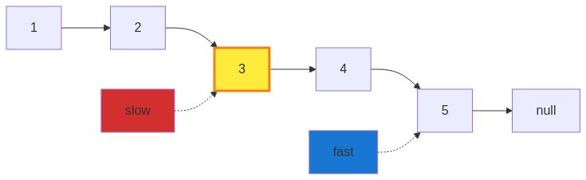

**代码：**
```javascript
function findMiddle(head) {
  let slow = head;
  let fast = head;
  
  while (fast !== null && fast.next !== null) {
    slow = slow.next;        // 慢指针走 1 步
    fast = fast.next.next;   // 快指针走 2 步
  }
  
  return slow; // 慢指针指向中点
}
```

#### 检测环
如果链表有环，快慢指针最终会在环内相遇。

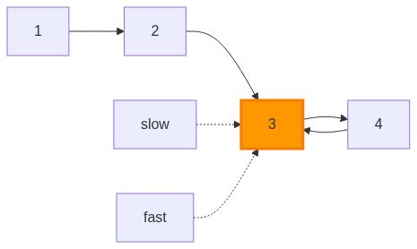

**代码：**
```javascript
function hasCycle(head) {
  let slow = head;
  let fast = head;
  
  while (fast !== null && fast.next !== null) {
    slow = slow.next;
    fast = fast.next.next;
    
    if (slow === fast) {
      return true; // 相遇说明有环
    }
  }
  
  return false; // fast 到达末尾，无环
}
```

### 原地修改（In-place）
在原有链表上进行操作，不创建新的链表，只改变节点间的连接关系。

**示例：反转链表**

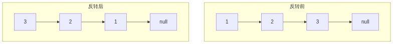

**代码：**
```javascript
function reverseList(head) {
  let prev = null;
  let current = head;
  
  while (current !== null) {
    let next = current.next;  // 保存下一个节点
    current.next = prev;      // 反转指针
    prev = current;           // 移动 prev
    current = next;           // 移动 current
  }
  
  return prev; // prev 成为新头节点
}
```
## 常见问题类型

### 反转链表（Reverse Linked List）
将链表的节点顺序完全颠倒。


**反转过程：**
1. 初始化：prev = null, current = head
2. 保存 next = current.next
3. 反转指针：current.next = prev
4. 移动指针：prev = current, current = next
5. 重复直到 current 为 null

### 合并链表（Merge Linked Lists）
将两个有序链表合并成一个有序链表。

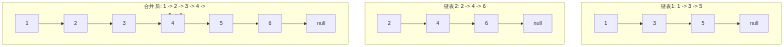

**示例：**
```
链表1：  1 -> 3 -> 5 -> null
链表2：  2 -> 4 -> 6 -> null

合并后： 1 -> 2 -> 3 -> 4 -> 5 -> 6 -> null
```

**思路：** 使用双指针分别指向两个链表，比较值大小，较小的加入结果链表

### 删除重复元素（Remove Duplicates）
删除链表中重复的节点。

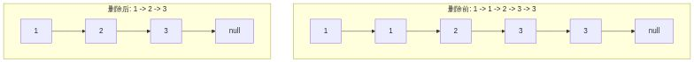

**示例：**
```
删除前：  1 -> 1 -> 2 -> 3 -> 3 -> null
删除后：  1 -> 2 -> 3 -> null
```

### 检测环（Detect Cycle）
判断链表中是否存在环结构。


**有环 vs 无环：**
- 有环：节点形成闭环
- 无环：链表以 null 结尾

### 相交链表（Intersection）
找到两个链表的相交节点。

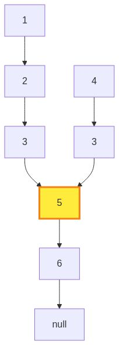

**示例：**
```
链表A：    1 -> 2 -> 3 ─┐
                        ├─> 5 -> 6 -> null
链表B：    4 -> 3 ──────┘

相交节点：节点 5
```

### 回文链表（Palindrome）
判断链表是否具有回文性质。

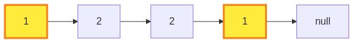

**示例：**
- 回文：`1 -> 2 -> 2 -> 1 -> null`
- 非回文：`1 -> 2 -> 3 -> 1 -> null`

**思路：**
1. 使用快慢指针找到中点
2. 反转后半部分
3. 比较前后两部分是否相同

